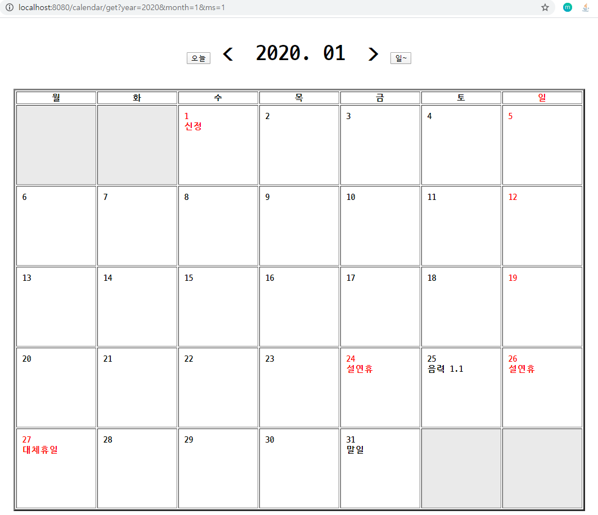
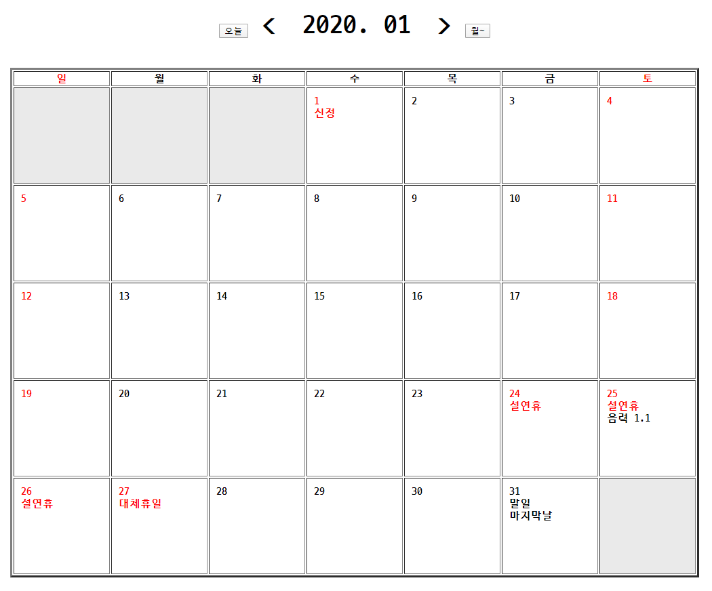

# Calendar src

## 1차시

- calendarServiceImpl

  ```java
  @Service
  public class CalendarServiceImpl implements CalendarService {
  	
  	@SuppressWarnings("deprecation")
  	@Override
  	public Map<String, Object> calendar() {
  		
  		final int WEEK_DAY =7;
  		
  		Map<String, Object> result = new HashMap<String, Object>();
  		
  		Date cal = new Date();
  		cal.setDate(1);
  		
  		Date cloneCal = new Date();
  		cloneCal.setMonth(cal.getMonth());
  		
  		// 말일 구하기
  		int lastDayOfMonth = 28;
  		for(; lastDayOfMonth <= 35; lastDayOfMonth++) {
  			cloneCal.setDate(lastDayOfMonth);
  			if (cloneCal.getMonth() != cal.getMonth()) {
  				lastDayOfMonth--;
  				break;
  			}
  		}
  		
  		DateFormat format = new SimpleDateFormat("yyyy. MM");
  		// 현재 연/월
  		String dateStr = format.format(cal.getTime());
  		result.put("calTitle", dateStr);
  		
  		ArrayList<String> arrCal = new ArrayList<String>();
  		
  		int day = 1;
  		int lengthOfMonth = cal.getDay() + lastDayOfMonth;
  		
  		int normalLength = WEEK_DAY * 5;
  		int maxLength = WEEK_DAY * 6;
  		
  		for (int i = 0; i < maxLength; i++) {
  			if ((i >= cal.getDay()) && (i <lengthOfMonth)) {
  				arrCal.add(Integer.toString(day));
  				day++;
  			} else {
  				arrCal.add(" ");
  			}
  		}
  		
  		List<String> sub = null;
  		String td = "";
  		int weekCnt = 0;
  		if (arrCal.get(35) == " ") {
  			weekCnt = normalLength / WEEK_DAY;
  		} else {
  			weekCnt = maxLength / WEEK_DAY;
  		}
  		
          // Iterator 로 변환 시도
  		for (int i = 0; i < weekCnt; i++) {
  			sub = arrCal.subList(i * WEEK_DAY, (i + 1) * WEEK_DAY);
  			td += "<tr><td>";
  			td += String.join("</td><td>", sub);
  			td += "</td></tr>";
  		}
  		
  		result.put("td", td);
  		
  		return result;
  	}
  
  }
  
  ```
  
- calendarController

  ```java
  package com.test.controller;
  
  import org.springframework.beans.factory.annotation.Autowired;
  import org.springframework.stereotype.Controller;
  import org.springframework.ui.Model;
  import org.springframework.web.bind.annotation.GetMapping;
  import org.springframework.web.bind.annotation.RequestMapping;
  
  import com.test.service.CalendarService;
  
  @Controller
  @RequestMapping("/calendar/*")
  public class CalendarController {
  	
  	@Autowired
  	private CalendarService service;
  	
  	@GetMapping("/get")
  	public void calendar(Model model) {
  		model.addAttribute("calendar", service.calendar());
  	}
  }
  
  ```

- jsp

  ```java
  <!DOCTYPE html PUBLIC "-//W3C//DTD HTML 4.01 Transitional//EN" "http://www.w3.org/TR/html4/loose.dtd">
  <html>
  <%@ page language="java" contentType="text/html; charset=UTF-8"
  	pageEncoding="UTF-8"%>
  
  <%@ taglib uri="http://java.sun.com/jsp/jstl/core" prefix="c"%>
  <%@ taglib uri="http://java.sun.com/jsp/jstl/fmt" prefix="fmt"%>
  <head>
  <meta http-equiv="Content-Type" content="text/html; charset=EUC-KR">
  <title>calendar</title>
  <!-- style -->
  <style>
  th {
  	width: 100px;
  }
  
  td {
  	vertical-align: top;
  	width: 100px;
  	height: 100px;
  }
  
  th, td {
  	font-weight: bolder;
  }
  
  p {
  	font-size: 30px;
  	font-weight: bolder;
  }
  </style>
  </head>
  <body>
  
  	<center>
  		<div id="calendar-main">
  			
  				<p>${calendar.calTitle}</p>
  				
  				<table border="3">
  					<tr>
  						<th style='color: red;'>일</th>
  						<th>월</th>
  						<th>화</th>
  						<th>수</th>
  						<th>목</th>
  						<th>금</th>
  						<th>토</th>
  					</tr>
  					
  					${calendar.td}
  				
  				</table>
  		</div>
  	</center>
  </body>
  </html>
  ```


## 2차시

- CalendarServiceImpl

  ```java
  @Service
  public class CalendarServiceImpl implements CalendarService {
  
  	@SuppressWarnings({ "deprecation", "null" })
  	@Override
  	public Map<String, Object> calendar() {
  
  		...
  		
          // List 안에 List 생성
  		List<List<String>> weeks = new ArrayList<List<String>>();
  		
  
  		List<String> sub = null;
  		String td = "";
          // 삼항연산자
  		int weekCnt = (arrCal.get(35) == " ") ? normalLength / WEEK_DAY : maxLength / WEEK_DAY;
  		
          // List 안에 List를 선언하면 아래와 같이 list에 sub한 list를 넣을 수 있다.
  		for(int i = 0; i < weekCnt; i++) {
  			weeks.add(arrCal.subList(i * WEEK_DAY, (i + 1) * WEEK_DAY));
  		}
  		
  		System.out.println(weeks);
  		
  		String html= "";
  		for(List<String> week : weeks) {
  			html += "<tr>" + "\n";
  			Iterator<String> it = week.iterator();
  			while (it.hasNext()) {
  				String tgtDate = it.next();
  				html += "<td>" + tgtDate + "</td>" + "\n";
  			}
  			html += "</tr>" + "\n";
  		}
  		System.out.println(html);
  		
  		result.put("td", html);
  
  		return result;
  	}
  
  }
  ```


## 3차시

- CalendarServiceImpl

  ```java
  @Service
  public class CalendarServiceImpl implements CalendarService {
  
  	@SuppressWarnings("deprecation")
  	@Override
  	public Map<String, Object> calendar(int year, int month, int ms) {
  
  		final int WEEK_DAY = 7;
  
  		Map<String, Object> result = new HashMap<String, Object>();
  
  		result.put("year", year);
  		result.put("month", month);
  
  		year -= 1900;
  		month--;
  
  		Date cal = new Date();
  
  		result.put("today", cal.getMonth() + 1);
  
  		cal.setYear(year);
  		cal.setMonth(month);
  		cal.setDate(1);
  
  		Date cloneCal = new Date();
  		cloneCal.setMonth(cal.getMonth());
  
  		// 말일 구하기
  		int lastDayOfMonth = 28;
  		for (; lastDayOfMonth <= 35; lastDayOfMonth++) {
  			cloneCal.setDate(lastDayOfMonth);
  			if (cloneCal.getMonth() != cal.getMonth()) {
  				lastDayOfMonth--;
  				break;
  			}
  		}
  
  		DateFormat format = new SimpleDateFormat("yyyy. MM");
  		// 현재 연/월
  		String dateStr = format.format(cal.getTime());
  		result.put("calTitle", dateStr);
  
  		ArrayList<String> arrCal = new ArrayList<String>();
  
  		int day = 1;
  		int lengthOfMonth = cal.getDay() + lastDayOfMonth;
  
  		int normalLength = WEEK_DAY * 5;
  		int maxLength = WEEK_DAY * 6;
  
  		int msYesOrNo = 0;
  		if (ms == 0) {
  			msYesOrNo = 0;
  		} else {
  			msYesOrNo = 1;
  		}
  
  		// 월화수목금토
  		for (; msYesOrNo < maxLength; msYesOrNo++) {
  			if ((msYesOrNo >= cal.getDay()) && (msYesOrNo < lengthOfMonth)) {
  				arrCal.add(Integer.toString(day));
  				day++;
  			} else {
  				arrCal.add(" ");
  			}
  		}
  
  		result.put("ms", ms);
  
  		int weekCnt = (arrCal.get(35) == " ") ? normalLength / WEEK_DAY : maxLength / WEEK_DAY;
  
  		// 2중 리스트
  		List<List<String>> weeks = new ArrayList<List<String>>();
  
  		// 2중 리스트가 선언되면 아래와 같이 sub된 리스트를 리스트에 넣을 수 있다.
  		for (int i = 0; i < weekCnt; i++) {
  			weeks.add(arrCal.subList(i * WEEK_DAY, (i + 1) * WEEK_DAY));
  		}
  
  		// 공휴일 TSV
  
  		List<String> split;
  		// 2중 맵
  		Map<String, Map<String, String>> holy = new HashMap<String, Map<String, String>>();
  
  		File file = new File("C:\\Users\\Bizspring\\Documents\\tsv.txt");
  		try {
  			BufferedReader br = new BufferedReader(new InputStreamReader(new FileInputStream(file), "utf-8"));
  
  			String line = "";
  
  			while ((line = br.readLine()) != null) {
  				split = Arrays.asList(line.split("\t"));
  
  				if (Integer.parseInt(split.get(0).substring(0, 4)) == (cal.getYear() + 1900)
  						&& Integer.parseInt(split.get(0).substring(5, 7)) == (cal.getMonth() + 1)) {
  
  					Map<String, String> map = new HashMap<String, String>();
  
  					map.put("anni", split.get(1));
  					map.put("holyday", split.get(2));
  					holy.put(Integer.toString(Integer.parseInt(split.get(0).substring(8))), map);
  				}
  			}
  		} catch (Exception e) {
  			System.out.println(e);
  		}
  		System.out.println(holy);
  
  		/////////////////////////////////////////////////////////////
  		
  		// 3중 콜렉션
  		Map<String, List<Map<String, String>>> holyAnni = new HashMap<String, List<Map<String,String>>>();
  		String html = "";
  		for (List<String> week : weeks) {
  			html += "<tr>" + "\n";
  			// Iterator 사용
  			Iterator<String> it = week.iterator();
  			while (it.hasNext()) {
  				String itThis = it.next();
  				String holyday = "";
  				String anni = "";
  
  				if (holy.containsKey(itThis)) {
  					holyday = holy.get(itThis).get("holyday");
  					anni = holy.get(itThis).get("anni");
  				}
  
  				if (itThis != " ") {
  					cal.setDate(Integer.parseInt(itThis));
  					if (cal.getDay() == 0 | holyday.equals("Y")) { // 일요일, 공휴일
  						html += "<td><div style='color:red;'>" + itThis + "<br>" + anni + "</div></td>\n";
  					} else {
  						html += "<td>" + itThis + "<br>" + anni + "</td>\n";
  					}
  				} else {
  					html += "<td style='background-color:#eaeaea;'>" + itThis + "</td>\n";
  				}
  			}
  			html += "</tr>" + "\n";
  		}
  
  		result.put("html", html);
  
  		return result;
  	}
  
  }
  ```

- Controller

  ```java
  @Controller
  @RequestMapping("/calendar/*")
  public class CalendarController {
  	
  	@Autowired
  	private CalendarService service;
  	
  	@GetMapping("/get")
  	public void calendar(Model model, @RequestParam("year") int year, @RequestParam("month") int month, @RequestParam("ms") int ms) {
  		model.addAttribute("calendar", service.calendar(year, month, ms));
  	}
  }
  ```

- jsp

  ```html
  <!DOCTYPE html PUBLIC "-//W3C//DTD HTML 4.01 Transitional//EN" "http://www.w3.org/TR/html4/loose.dtd">
  <html>
  <%@ page language="java" contentType="text/html; charset=UTF-8"
  	pageEncoding="UTF-8"%>
  
  <%@ taglib uri="http://java.sun.com/jsp/jstl/core" prefix="c"%>
  <%@ taglib uri="http://java.sun.com/jsp/jstl/fmt" prefix="fmt"%>
  <head>
  <meta http-equiv="Content-Type" content="text/html; charset=EUC-KR">
  <title>calendar</title>
  <!-- style -->
  <style>
  th {
  	width: 100px;
  }
  
  td {
  	vertical-align: top;
  	width: 120px;
  	height: 120px;
  	padding: 10px;
  }
  
  th, td {
  	font-weight: bolder;
  }
  
  #title {
  	font-size: 40px;
  	font-weight: bolder;
  }
  
  a {
  	text-decoration: none;
  	color: black;
  }
  
  a:visited {
  	text-decoration: none;
  }
  
  a:hover {
  	text-decoration: none;
  }
  
  a:focus {
  	text-decoration: none;
  }
  </style>
  </head>
  <body>
  
  	<center>
  
  		<p id="title">
  			<button type="button"
  				onclick="location.href='<c:url value='./get?year=${calendar.year}&month=${calendar.today}&ms=${calendar.ms}'/>'">오늘</button>
  			<a
  				href="<c:url value='./get?year=${calendar.year}&month=${calendar.month - 1}&ms=${calendar.ms}'/>">&lt;&emsp;</a>
  			${calendar.calTitle} <a
  				href="<c:url value='./get?year=${calendar.year}&month=${calendar.month + 1}&ms=${calendar.ms}'/>">&emsp;&gt;</a>
  
  			<c:choose>
  				<c:when test="${calendar.ms eq 0}">
  					<button type="button"
  						onclick="location.href='<c:url value='./get?year=${calendar.year}&month=${calendar.today}&ms=1'/>'">월~</button>
  				</c:when>
  				<c:otherwise>
  					<button type="button"
  						onclick="location.href='<c:url value='./get?year=${calendar.year}&month=${calendar.today}&ms=0'/>'">일~</button>
  				</c:otherwise>
  			</c:choose>
  		</p>
  
  		<table border="3">
  			<tr>
  				<c:choose>
  					<c:when test="${calendar.ms eq 0}">
  						<th style='color: red;'>일</th>
  						<th>월</th>
  						<th>화</th>
  						<th>수</th>
  						<th>목</th>
  						<th>금</th>
  						<th>토</th>
  					</c:when>
  					<c:otherwise>
  						<th>월</th>
  						<th>화</th>
  						<th>수</th>
  						<th>목</th>
  						<th>금</th>
  						<th>토</th>
  						<th style='color: red;'>일</th>
  					</c:otherwise>
  				</c:choose>
  			</tr>
  
  			${calendar.html}
  
  		</table>
  	</center>
  </body>
  </html>
  ```

- 결과 화면

  

## 4차시

- CalendarServiceImpl

  ```java
  @Service
  public class CalendarServiceImpl implements CalendarService {
  
  	@SuppressWarnings("deprecation")
  	@Override
  	public Map<String, Object> calendar(int year, int month, int ms) {
  
  		final int WEEK_DAY = 7;
  
  		Map<String, Object> result = new HashMap<String, Object>();
  
  		result.put("year", year);
  		result.put("month", month);
  
  		year -= 1900;
  		month--;
  
  		Date cal = new Date();
  
  		result.put("today", cal.getMonth() + 1);
  
  		cal.setYear(year);
  		cal.setMonth(month);
  		cal.setDate(1);
  
  		Date cloneCal = new Date();
  		cloneCal.setMonth(cal.getMonth());
  
  		// 말일 구하기
  		int lastDayOfMonth = 28;
  		for (; lastDayOfMonth <= 35; lastDayOfMonth++) {
  			cloneCal.setDate(lastDayOfMonth);
  			if (cloneCal.getMonth() != cal.getMonth()) {
  				lastDayOfMonth--;
  				break;
  			}
  		}
  
  		DateFormat format = new SimpleDateFormat("yyyy. MM");
  		// 현재 연/월
  		String dateStr = format.format(cal.getTime());
  		result.put("calTitle", dateStr);
  
  		ArrayList<String> arrCal = new ArrayList<String>();
  
  		int day = 1;
  		int lengthOfMonth = cal.getDay() + lastDayOfMonth;
  
  		int normalLength = WEEK_DAY * 5;
  		int maxLength = WEEK_DAY * 6;
  
  		int msYesOrNo = 0;
  		if (ms == 0) {
  			msYesOrNo = 0;
  		} else {
  			msYesOrNo = 1;
  		}
  
  		// 월화수목금토
  		for (; msYesOrNo < maxLength; msYesOrNo++) {
  			if ((msYesOrNo >= cal.getDay()) && (msYesOrNo < lengthOfMonth)) {
  				arrCal.add(Integer.toString(day));
  				day++;
  			} else {
  				arrCal.add(" ");
  			}
  		}
  
  		result.put("ms", ms);
  
  		int weekCnt = (arrCal.get(35) == " ") ? normalLength / WEEK_DAY : maxLength / WEEK_DAY;
  
  		// 2중 리스트
  		List<List<String>> weeks = new ArrayList<List<String>>();
  
  		// 2중 리스트가 선언되면 아래와 같이 sub된 리스트를 리스트에 넣을 수 있다.
  		for (int i = 0; i < weekCnt; i++) {
  			weeks.add(arrCal.subList(i * WEEK_DAY, (i + 1) * WEEK_DAY));
  		}
  
  		// 공휴일 TSV
  
  		List<String> split;
  		// 2중 맵
  		Map<String, Map<String, String>> holy = new HashMap<String, Map<String, String>>();
  
  		File file = new File("C:\\Users\\Bizspring\\Documents\\tsv.txt");
  		try {
  			BufferedReader br = new BufferedReader(new InputStreamReader(new FileInputStream(file), "utf-8"));
  
  			String line = "";
  
  			while ((line = br.readLine()) != null) {
  				split = Arrays.asList(line.split("\t"));
  
  				if (Integer.parseInt(split.get(0).substring(0, 4)) == (cal.getYear() + 1900)
  						&& Integer.parseInt(split.get(0).substring(5, 7)) == (cal.getMonth() + 1)) {
  
  					Map<String, String> map = new HashMap<String, String>();
  
  					if (!holy.containsKey(Integer.toString(Integer.parseInt(split.get(0).substring(8))))) {
  						map.put("anni", split.get(1));
  						map.put("holyday", split.get(2));
  					} else {
  						Map<String, String> temp = new HashMap<String, String>();
  						temp = holy.get(Integer.toString(Integer.parseInt(split.get(0).substring(8))));
  						map.put("anni", temp.get("anni"));
  						map.put("holyday", temp.get("holyday"));
  						map.put("addAnni", split.get(1));
  					}
  					holy.put(Integer.toString(Integer.parseInt(split.get(0).substring(8))), map);
  				}
  			}
  		} catch (Exception e) {
  			System.out.println(e);
  		}
  
  		/////////////////////////////////////////////////////////////
  
  		String html = "";
  		for (List<String> week : weeks) {
  			html += "<tr>" + "\n";
  			// Iterator 사용
  			Iterator<String> it = week.iterator();
  			while (it.hasNext()) {
  				String itThis = it.next();
  				String holyday = "";
  				String anni = "";
  				String addAnni = null;
  
  				if (holy.containsKey(itThis)) {
  					holyday = holy.get(itThis).get("holyday");
  					anni = holy.get(itThis).get("anni");
  					if (holy.get(itThis).containsKey("addAnni")) {
  						addAnni = holy.get(itThis).get("addAnni");
  					}
  				}
  
  				if (itThis != " ") {
  					cal.setDate(Integer.parseInt(itThis));
  					if (cal.getDay() == 0 || cal.getDay() == 6 || holyday.equals("Y")) { // 일요일, 공휴일
  						html += "<td><div style='color:red;'>" + itThis + "<br>" + anni + "</div>";
  						if (addAnni != null) {
  							html += "<span>" + addAnni + "</span>";
  						}
  						html += "</td>\n";
  					} else {
  						html += "<td>" + itThis + "<br>" + anni;
  						if (addAnni != null) {
  							html += "<br><span>" + addAnni + "</span>";
  						}
  						html += "</td>\n";
  					}
  				} else {
  					html += "<td style='background-color:#eaeaea;'>" + itThis + "</td>\n";
  				}
  			}
  			html += "</tr>\n";
  		}
  
  		result.put("html", html);
  
  		return result;
  	}
  
  }
  ```

- jsp

  ```html
  <!DOCTYPE html PUBLIC "-//W3C//DTD HTML 4.01 Transitional//EN" "http://www.w3.org/TR/html4/loose.dtd">
  <html>
  <%@ page language="java" contentType="text/html; charset=UTF-8"
  	pageEncoding="UTF-8"%>
  
  <%@ taglib uri="http://java.sun.com/jsp/jstl/core" prefix="c"%>
  <%@ taglib uri="http://java.sun.com/jsp/jstl/fmt" prefix="fmt"%>
  <head>
  <meta http-equiv="Content-Type" content="text/html; charset=EUC-KR">
  <title>calendar</title>
  <!-- style -->
  <style>
  th {
  	width: 100px;
  }
  
  td {
  	vertical-align: top;
  	width: 120px;
  	height: 120px;
  	padding: 10px;
  }
  
  th, td {
  	font-weight: bolder;
  }
  
  #title {
  	font-size: 40px;
  	font-weight: bolder;
  }
  
  a {
  	text-decoration: none;
  	color: black;
  }
  
  a:visited {
  	text-decoration: none;
  }
  
  a:hover {
  	text-decoration: none;
  }
  
  a:focus {
  	text-decoration: none;
  }
  </style>
  </head>
  <body>
  
  	<center>
  
  		<p id="title">
  			<button type="button"
  				onclick="location.href='<c:url value='./get?year=${calendar.year}&month=${calendar.today}&ms=${calendar.ms}'/>'">오늘</button>
  			<a
  				href="<c:url value='./get?year=${calendar.year}&month=${calendar.month - 1}&ms=${calendar.ms}'/>">&lt;&emsp;</a>
  			${calendar.calTitle} <a
  				href="<c:url value='./get?year=${calendar.year}&month=${calendar.month + 1}&ms=${calendar.ms}'/>">&emsp;&gt;</a>
  
  			<c:choose>
  				<c:when test="${calendar.ms eq 0}">
  					<button type="button"
  						onclick="location.href='<c:url value='./get?year=${calendar.year}&month=${calendar.month}&ms=1'/>'">월~</button>
  				</c:when>
  				<c:otherwise>
  					<button type="button"
  						onclick="location.href='<c:url value='./get?year=${calendar.year}&month=${calendar.month}&ms=0'/>'">일~</button>
  				</c:otherwise>
  			</c:choose>
  		</p>
  
  		<table border="3">
  			<tr>
  				<c:choose>
  					<c:when test="${calendar.ms eq 0}">
  						<th style='color: red;'>일</th>
  						<th>월</th>
  						<th>화</th>
  						<th>수</th>
  						<th>목</th>
  						<th>금</th>
  						<th style='color: red;'>토</th>
  					</c:when>
  					<c:otherwise>
  						<th>월</th>
  						<th>화</th>
  						<th>수</th>
  						<th>목</th>
  						<th>금</th>
  						<th style='color: red;'>토</th>
  						<th style='color: red;'>일</th>
  					</c:otherwise>
  				</c:choose>
  			</tr>
  
  			${calendar.html}
  
  		</table>
  	</center>
  </body>
  </html>
  ```

- 화면

  

