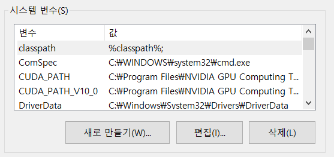
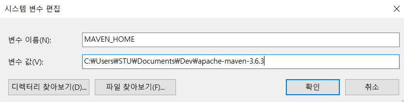
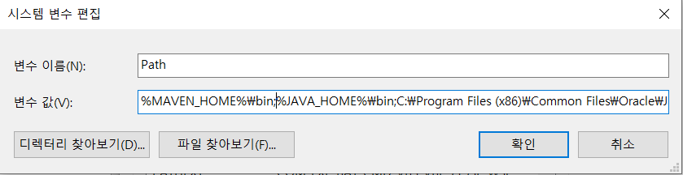
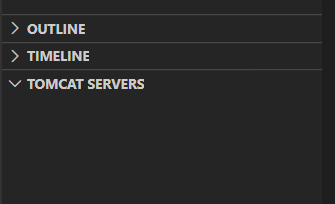
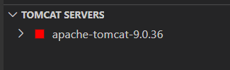
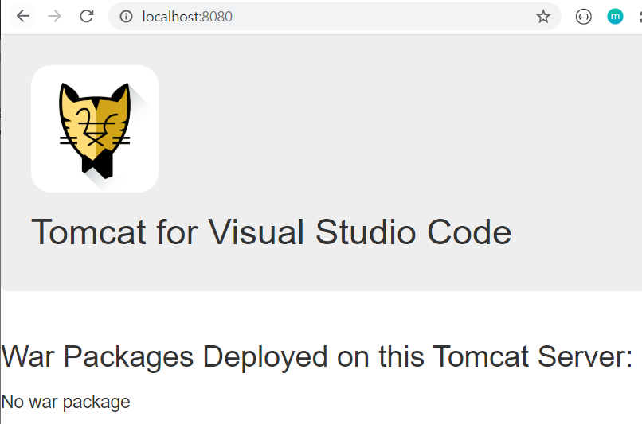

# Spring in VS Code


## 0. 사전 작업
### 0.1 메이븐 설치

- Binary zip archive 파일 [다운로드](https://maven.apache.org/download.cgi#) 

- 적절한 위치에 압축 해제

- 환경 변수 설정

  - 새로 만들기

    

  - 새 시스템 변수

    

  - 시스템 변수 목록에서 **Path**를 찾아 클릭하고 **편집**

  - 변수 값 맨 앞 부분에 `%MAVEN_HOME%bin;` 추가

    

  - 확인

    ```bash
    $ mvn -version
    
    Apache Maven 3.6.3 (cecedd343002696d0abb50b32b541b8a6ba2883f)
    Maven home: C:\Users\STU\Documents\Dev\apache-maven-3.6.3\bin\..
    Java version: 1.8.0_211, vendor: Oracle Corporation, runtime: C:\Program Files\Java\jdk1.8.0_211\jre
    Default locale: ko_KR, platform encoding: MS949
    OS name: "windows 10", version: "10.0", arch: "amd64", family: "windows"
    ```

### 0.2 Tomcat 설치

- [다운로드](https://tomcat.apache.org/download-90.cgi)

- VS Code 좌측 하단에 TOMCAT SERVERS

  

- 지정 후

  

- 서버 동작 확인

  - 우클릭 후 Start

  

## 1. 확장 프로그램 설치

- Checkstyle for Java
- Java Dependency Viewer
- Java Extension Pack
- JavaScript (ES6) code snippets
- Maven for Java
- Tomat for Java
- Spring Initializr Java Support
- Spring boot Extension Pack

