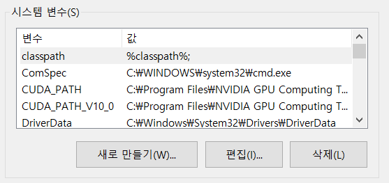
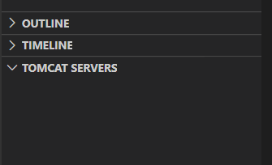
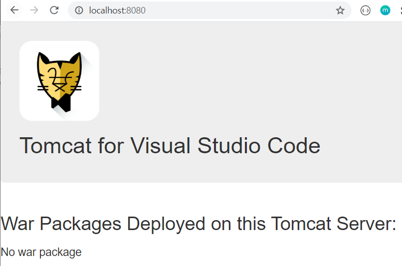

# Spring in VS Code

> https://myjamong.tistory.com/123?category=835076
>
> https://myjamong.tistory.com/155


## 0. 사전 작업
### 0.1 메이븐 설치

- Binary zip archive 파일 [다운로드](https://maven.apache.org/download.cgi#) 

- 적절한 위치에 압축 해제

- 환경 변수 설정

  - 새로 만들기

    

  - 새 시스템 변수

    

  - 시스템 변수 목록에서 **Path**를 찾아 클릭하고 **편집**

  - 변수 값 맨 앞 부분에 `%MAVEN_HOME%bin;` 추가

    

  - 확인

    ```bash
    $ mvn -version
    
    Apache Maven 3.6.3 (cecedd343002696d0abb50b32b541b8a6ba2883f)
    Maven home: C:\Users\STU\Documents\Dev\apache-maven-3.6.3\bin\..
    Java version: 1.8.0_211, vendor: Oracle Corporation, runtime: C:\Program Files\Java\jdk1.8.0_211\jre
    Default locale: ko_KR, platform encoding: MS949
    OS name: "windows 10", version: "10.0", arch: "amd64", family: "windows"
    ```

### 0.2 Tomcat 설치

- [다운로드](https://tomcat.apache.org/download-90.cgi)

- VS Code 좌측 하단에 TOMCAT SERVERS

  

- 지정 후

  

- 서버 동작 확인

  - 우클릭 후 Start

  

### 0.3 확장 프로그램 설치

- Checkstyle for Java
- Java Dependency Viewer
- Java Extension Pack
- Maven for Java
- Tomcat for Java
- Test Runner for Java
- Spring Boot Extension Pack

## 1. Spring MVC Project

### 1.1 프로젝트 생성

- `f1`을 눌러 패널을 열어자동으로 `Create Maven Project` 를 이용

  - `maven-archetype-quickstart` 클릭

    - Group Id 입력 (ex. com.example)
    - Artifact Id 입력 (ex. project-name)

  - 클릭하면 현재의 프로젝트 구조는

    ```
    └─demo
        ├─pom.xml
        ├─src
           ├─main
           │  └─java
           │      └─com
           │          └─example
           │                └─App.java
           │                  
           └─test
               └─java
                   └─com
                       └─example
                            └─AppTest.java
    ```

- `pom.xml`

  - VS Code 에서 maven 프로젝트 업데이트는 `pom.xml` 파일을 우클릭하여 `Update Project` 선택

  ```xml
  <?xml version="1.0" encoding="UTF-8"?>
  
  <project xmlns="http://maven.apache.org/POM/4.0.0" xmlns:xsi="http://www.w3.org/2001/XMLSchema-instance"
    xsi:schemaLocation="http://maven.apache.org/POM/4.0.0 http://maven.apache.org/xsd/maven-4.0.0.xsd">
    <modelVersion>4.0.0</modelVersion>
  
    <groupId>com.example</groupId>
    <artifactId>demo</artifactId>
    <version>1.0-SNAPSHOT</version>
    <packaging>war</packaging>
  
    <name>demo</name>
  
    <properties>
      <org.springframework-version>5.0.2.RELEASE</org.springframework-version>
      <fileName>${artifactId}</fileName>
    </properties>
  
    <dependencies>
      <!-- Spring-->
      <dependency>
        <groupId>org.springframework</groupId>
        <artifactId>spring-context</artifactId>
        <version>${org.springframework-version}</version>
      </dependency>
      <dependency>
        <groupId>org.springframework</groupId>
        <artifactId>spring-webmvc</artifactId>
        <version>${org.springframework-version}</version>
      </dependency>
      <!-- JUnit-->
      <dependency>
        <groupId>junit</groupId>
        <artifactId>junit</artifactId>
        <version>4.11</version>
        <scope>test</scope>
      </dependency>
    </dependencies>
  
    <build>
      <!-- war로 묶을때 만들어지는 파일명 -->
      <finalName>${fileName}</finalName>
      <plugins>
        <plugin>
          <artifactId>maven-compiler-plugin</artifactId>
          <version>3.8.0</version>
          <configuration>
            <source>1.8</source>
            <target>1.8</target>
            <encoding>UTF-8</encoding>
          </configuration>
        </plugin>
      </plugins>
    </build>
  </project>
  ```

- 폴더 구조를 다음과 같이 생성

  ```
  └─demo
      ├─pom.xml     
      └─src
         ├─main
         │  ├─java
         │  │  └─com
         │  │      └─example
         │  │          └─App.java
         │  │              
         │  └─webapp
         │      └─WEB-INF
         │          │  └─web.xml
         │          │  
         │          ├─spring
         │          │  ├─root-context.xml
         │          │  │  
         │          │  └─appServlet
         │          │        └─servlet-context.xml
         │          │          
         │          └─views
         │             └─home.jsp
         │                  
         └─test
             └─java
                 └─com
                     └─example
                           └─AppTest.java
  ```

  - `web.xml`

    ```xml
    <?xml version="1.0" encoding="UTF-8"?>
    <web-app version="2.5" xmlns="http://java.sun.com/xml/ns/javaee"
    	xmlns:xsi="http://www.w3.org/2001/XMLSchema-instance"
    	xsi:schemaLocation="http://java.sun.com/xml/ns/javaee https://java.sun.com/xml/ns/javaee/web-app_2_5.xsd">
    
    	<!-- The definition of the Root Spring Container shared by all Servlets and Filters -->
    	<context-param>
    		<param-name>contextConfigLocation</param-name>
    		<param-value>/WEB-INF/spring/root-context.xml</param-value>
    	</context-param>
    	
    	<!-- Creates the Spring Container shared by all Servlets and Filters -->
    	<listener>
    		<listener-class>org.springframework.web.context.ContextLoaderListener</listener-class>
    	</listener>
    
    	<!-- Processes application requests -->
    	<servlet>
    		<servlet-name>appServlet</servlet-name>
    		<servlet-class>org.springframework.web.servlet.DispatcherServlet</servlet-class>
    		<init-param>
    			<param-name>contextConfigLocation</param-name>
    			<param-value>/WEB-INF/spring/appServlet/servlet-context.xml</param-value>
    		</init-param>
    		<load-on-startup>1</load-on-startup>
    	</servlet>
    		
    	<servlet-mapping>
    		<servlet-name>appServlet</servlet-name>
    		<url-pattern>/</url-pattern>
    	</servlet-mapping>
    
    </web-app>
    ```

  - `root-context.xml`

    ```
    <?xml version="1.0" encoding="UTF-8"?>
    <beans xmlns="http://www.springframework.org/schema/beans"
    	xmlns:xsi="http://www.w3.org/2001/XMLSchema-instance"
    	xsi:schemaLocation="http://www.springframework.org/schema/beans https://www.springframework.org/schema/beans/spring-beans.xsd">
    	
    	<!-- Root Context: defines shared resources visible to all other web components -->
    		
    </beans>
    ```

  - `servlet-context.xml`

    ```xml
    <?xml version="1.0" encoding="UTF-8"?>
    <beans:beans xmlns="http://www.springframework.org/schema/mvc"
    	xmlns:xsi="http://www.w3.org/2001/XMLSchema-instance"
    	xmlns:beans="http://www.springframework.org/schema/beans"
    	xmlns:context="http://www.springframework.org/schema/context"
    	xsi:schemaLocation="http://www.springframework.org/schema/mvc https://www.springframework.org/schema/mvc/spring-mvc.xsd
    		http://www.springframework.org/schema/beans https://www.springframework.org/schema/beans/spring-beans.xsd
    		http://www.springframework.org/schema/context https://www.springframework.org/schema/context/spring-context.xsd">
    
    	<!-- DispatcherServlet Context: defines this servlet's request-processing infrastructure -->
    	
    	<!-- Enables the Spring MVC @Controller programming model -->
    	<annotation-driven />
    
    	<!-- Resolves views selected for rendering by @Controllers to .jsp resources in the /WEB-INF/views directory -->
    	<beans:bean class="org.springframework.web.servlet.view.InternalResourceViewResolver">
    		<beans:property name="prefix" value="/WEB-INF/views/" />
    		<beans:property name="suffix" value=".jsp" />
    	</beans:bean>
    	
    	<context:component-scan base-package="com.example" />
    	
    	
    	
    </beans:beans>
    ```

### 1.2 프로젝트 실행

```bash
# 생성된 메이븐이 있다면 삭제
$ mvn clean

$ mvn install
```

- `target` 폴더에서 war 파일을 우클릭 후 tomcat 서버 실행 후 `localhost:8080/demo/` 에 접속 확인

## 2. Spring Boot Project

### 2.1 프로젝트 생성

- `ctrl` + `shift` + `p` 또는 `f1` 키를 열어 패널 열기
  - Spring initializr: maven 또는 gradle 프로젝트 생성
  - Spring Boot Version 선택 현재 stable한 2.5.5 선택
  - 프로젝트 언어 선택 (Java)
  - Group Id 입력 (ex. com.example)
  - Artifact Id 입력 (ex. project-name)
  - Packaging Type 선택 - 웹 어플리케이션은 War
  - Java Version 선택
  - Dependencis 선택 (기본 선택 후 추후 추가)
    - Spring Boot DevTools
    - Spring Web
  - 원하는 디렉토리 지정후 `Generate into this folder`

### 2.2 Maven Project

- `src/main/resoureces`에 기본적으로 `application.properties`에 설정들이 들어있지만 `application.yml`로 대체 가능

  ```yaml
  server:
  	port: 8081	# 포트 설정
  	servlet:
  		context-path: /demo	# 현재 프로젝트 path 설정
  ```

  - 저장 후에 vscode explorer에서 해당 프로젝트를  우클릭 하여`Check Code with Checkstyle` 눌러 적용

- 테스트용 컨트롤러 작성

  ```java
  @RestController
  public class HelloController {
      
      @RequestMapping("/")
      public String hello() {
          return "HELLO, SPRING BOOT";
      }
  }
  ```

- 위의 설정처럼 `localhost:8081/demo/` 에 들어가 HELLO, SPRING BOOT가 뜨는지 확인

- 만약 개인 설정 파일이 따로 있다면 `.vscode`의 **`launch.json`**을 찾아 `vmArgs: []` 를 추가 후 배열안에 넣어주면 됨

  - 그냥 한번이라도 프로젝트 런하면 `.launch.json` 파일은 생성되므로, 한번 실행시킨후 파일을 찾아도 됨

  ```json
  // 예시
  {
      "configurations": [
          {
              "type": "java",
              "name": "<project-name>",
              "request": "launch",
              "cwd": "${workspaceFolder}",
              "console": "internalConsole",
              "mainClass": "<main-class>",
              "progjectName": "<project-name>",
              "vmArgs": [
                  "config-file-location=config-file-name"
              ]
          }
      ]
  }
  ```

- 추가로 JUnit 테스트시에도 개인 설정 파일을 사용한다면 `.vscode`의 **`settings.json`**을 찾아 아래와 같이 추가

  ```json
  {
      "java.test.config": {
          "name": "testConfiguration",
          "workingDirectory": "${workspaceFolder}"
          "vmArgs": [
              "-Dspring.config.name=<설정 파일명>" // name
          ]
      },
  	"java.configuration.updateBuildConfiguration": "automatic"
  }
  ```


## 프로젝트 clone시 주의점

- Spring은 `application.yml` 파일을 기준으로 설정을 잡고있음
- 협업시 이 설정을 본인의 개발환경에 맞게 적절히 변환해 주어야함
- 본인의 경우 Eclipse로 개발을 하다가 VS Code로 바꾸면서 이 설정을 잊어먹어 하루종일 헤메었음...(`basedir` )
