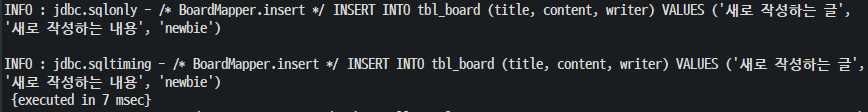

# Spring CRUD 구현

## 1. 영속 계층 구현

- 영속 계층의 작업은 항상 다음과 같은 순서로 진행
  - 테이블의 칼럼 구조를 반영하는 VO(Value Object) 클래스의 생성
  - MyBatis의 Mapper 인터페이스의 작성/XML 처리
  - 작성한 Mapper 인터페이스의 테스트

### 1.1 VO 클래스 작성

- 프로젝트에 com.test.domain 패키지를 생성하고, BoardVO 클래스를 정의

  

  ```java
  @Data	// getter/setter, toString()을 지원
  public class BoardVO {
  
  	private Long bno;
  	private String title;
  	private String content;
  	private String writer;
  	private Date regdate;
  	private Date updateDate;
  }
  ```

### 1.2 Mapper

#### 1.2.1 Mapper 인터페이스

- root-context.xml 추가

  ```xml
  <mybatis-spring:scan base-package="com.test.mapper"/>
  ```

- 프로젝트에 com.test.mapper 패키지를 생성하고, BoardMapper 인터페이스를 정의

  ```java
  public interface BoardMapper {
  	@Select("SELECT * FROM tbl_board WHERE bno > 0")
  	public List<BoardVO> getList();
  }
  ```

- src/test/java 에 com.test.mapper 패키지를 생성하고 BoardMapperTests 클래스를 추가

  ```java
  @RunWith(SpringJUnit4ClassRunner.class)
  @ContextConfiguration("file:src/main/webapp/WEB-INF/spring/root-context.xml")
  @Log4j
  public class BoardMapperTests {
  	
  	@Setter(onMethod_ = @Autowired)
  	private BoardMapper mapper;
  	
  	@Test
  	public void testGetList() {
  		mapper.getList().forEach(board -> log.info(board));
  	}
  }
  ```

- 테스트 결과

  

#### 1.2.2 Mapper XML

- src/main/resources에 패키지와 동일한 com/test/mapper 단계의 폴더를 생성하고 XML 파일을 작성

  

- BoardMapper.xml

  ```xml
  <?xml version="1.0" encoding="UTF-8"?>
  <!DOCTYPE mapper PUBLIC "-//mybatis.org//DTD Mapper 3.0//EN"
  	"http://mybatis.org/dtd/mybatis-3-mapper.dtd">
  <mapper namespace="com.test.mapper.BoardMapper">
  
  	<select id="getList" resultType="com.test.domain.BoardVO">
  		<!-- CDATA는 안에 들어가는 테스트가 파싱되지 않게 하는 기능 -->
  		/* BoardMapper.getList */
  		<![CDATA[
  			SELECT * FROM tbl_board WHERE bno >0
  		]]>
  	</select>
  </mapper>
  ```

- XML 파일에 SQL문이 처리되었으니 **BoardMapper 인터페이스에 SQL은 제거** 후 테스트 확인

  

### 1.3 CRUD 구현

#### 1.3.1 Create

- BoardMapper 인터페이스 

  ```java
  public void insert(BoardVO board);
  	
  public void insertSelectKey(BoardVO board);
  ```

- BoardMapper.xml

  ```xml
  <insert id="insert">
  	/* BoardMapper.insert */
  	INSERT INTO tbl_board (title, content, writer)
  	VALUES (#{title}, #{content}, #{writer})
  </insert>
  
  <insert id="insertSelectKey">
  	<selectKey keyProperty="bno" order="BEFORE" resultType="long">
  		SELECT IFNULL(MAX(bno), 0) + 1 FROM tbl_board
  	</selectKey>
  	/* BoardMapper.insertSelectKey */
  	INSERT INTO tbl_board (bno, title, content, writer)
  	VALUES (#{bno}, #{title}, #{content}, #{writer})
  </insert>
  ```

- BoardMapperTests.java

  ```java
  @Test
  public void testInsert() {
  		
  	BoardVO board = new BoardVO();
  	board.setTitle("새로 작성하는 글");
  	board.setContent("새로 작성하는 내용");
  	board.setWriter("newbie");
  	
  	mapper.insert(board);
  	log.info(board);
  		
  }
  ```

- insert 성공시

  

#### 1.3.2 Read

- BoardMapper 인터페이스

  ```java
  public BoardVO read(long bno);
  ```

- BoardMapper.xml

  ```xml
  <select id="read" resultType="com.test.domain.BoardVO">
  	SELECT * FROM tbl_board WHERE bno = #{bno}
  </select>
  ```

- BoardMapperTests 클래스

  ```java
  @Test
  public void testRead() {
      BoardVO board = mapper.read(5L);
      
      log.info(board);
  }
  ```

- Read 성공시

  

#### 1.3.3 Update

- BoardMapper 인터페이스

  ```java
  public int update(BoardVO board);
  ```

- BoardMapper.xml

  ```xml
  <update id="update">
  	/* BoardMapper.update */
  	UPDATE tbl_board
  	SET title=#{title}, content=#{content}, writer=#{writer}, updatedate=NOW()
  	WHERE bno=#{bno} 
  </update>
  ```

- BoardMapperTests 클래스

  ```java
  @Test
  public void testUpdate() {
  	BoardVO board = new BoardVO();
  	board.setBno(6L);
  	board.setTitle("수정된 제목");
  	board.setContent("수정된 내용");
  	board.setWriter("user00");
  
  	int count = mapper.update(board);
  	log.info("UPDATE COUNT: " + count);
  }
  ```

- update 성공 시

  

#### 1.3.4 Delete

- BoardMapper 인터페이스

  ```java
  public int delete(long bno);
  ```

- BoardMapper.xml

  ```xml
  <delete id="delete">
  	/* BoardMapper.delete */
  	DELETE FROM tbl_board WHERE bno = #{bno}
  </delete>
  ```

- BoardMapperTests 클래스

  ```java
  @Test
  public void testDelete() {
      log.info("DELETE COUNT : " + mapper.delete(3L));
  }
  ```

- delete 성공시

  

