# SpringMVC + MySQL 설정 과정

- SpringMVC + MySQL + MyBatis + Log4j + lombok + HikariCP 

## 1. SpringMVC

### 1.1 프로젝트 생성

- **Spring Legacy Project** 선택

  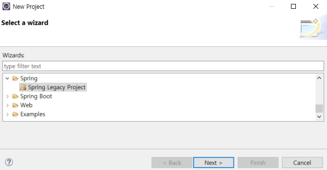

- **Spring MVC Project**를 선택하고 프로젝트명을 적어준다.

  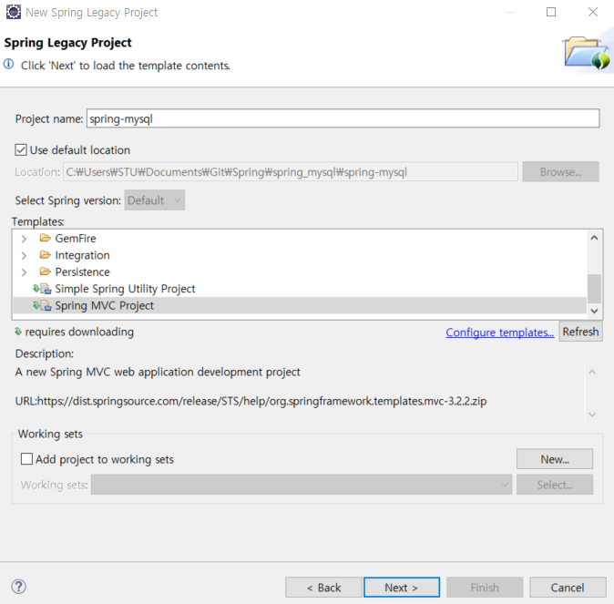

- 패키지명을 적고 마무리한다.

  - 패키지명은 보통 **도메인명을 뒤집어**서 한다.

  

- 폴더 구조

  

### 1.2 pom.xml 설정

- 현재 사용하는 jdk버전과 spring 버전을 맞춰준다.

  ```xml
  ...
  <properties>
  	<java-version>1.8</java-version>	<!-- 1.6 -> 1.8 -->
  	<org.springframework-version>5.2.2.RELEASE</org.springframework-version>
  	<org.aspectj-version>1.6.10</org.aspectj-version>
  	<org.slf4j-version>1.6.6</org.slf4j-version>
  </properties>
  ...
  <!-- 중략 -->
  ...
  <plugin>
  	<groupId>org.apache.maven.plugins</groupId>
      <artifactId>maven-compiler-plugin</artifactId>
      <version>2.5.1</version>
      <configuration>
      	<source>1.8</source>	<!-- 1.6 -> 1.8 -->
          <target>1.8</target>	<!-- 1.6 -> 1.8 -->
          <compilerArgument>-Xlint:all</compilerArgument>
          <showWarnings>true</showWarnings>
          <showDeprecation>true</showDeprecation>
      </configuration>
  </plugin>
  ...
  ```

### 1.3 오류 잡기

- 이클립스 하단의 Martkers를 보면 현재 다양한 오류들을 이클립스에서 경고를 하고있다.

  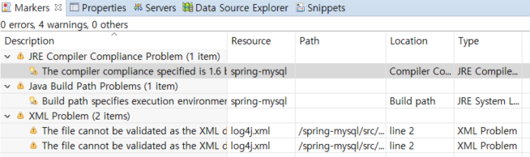

#### 1.3.1 Java Version 문제

- **프로젝트를 우클릭**하고 **Maven - Update Project...**

  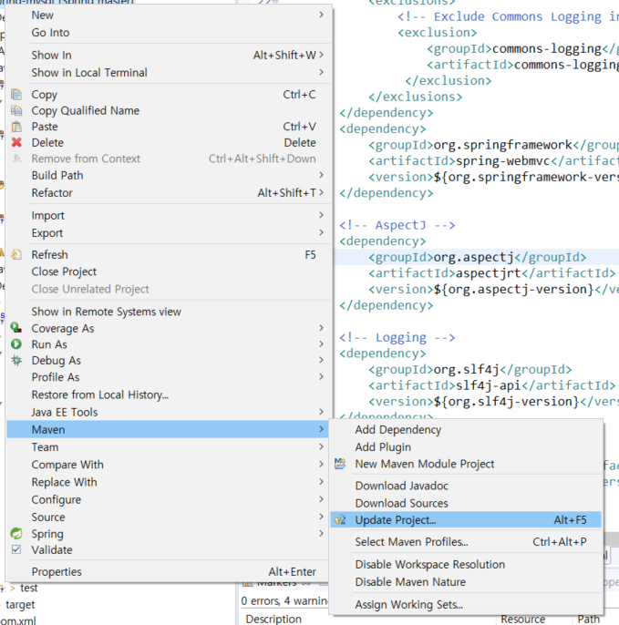

- 이렇게 진행하면 java compiler와 build path version 오류는 사라진다.

  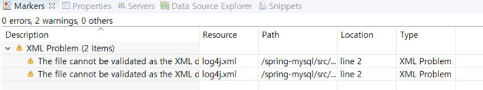

#### 1.3.2 log4j 파일 경로 문제

- 해당 오류를 **더블클릭**하면 해당 오류로 갈 수 있다.

- 수정 전

  ```xml
  <!DOCTYPE log4j:configuration PUBLIC "-//APACHE//DTD LOG4J 1.2//EN" "log4j.dtd">
  ```

- 수정 후

  ```xml
  <!DOCTYPE log4j:configuration SYSTEM "http://logging.apache.org/log4j/1.2/apidocs/org/apache/log4j/xml/doc-files/log4j.dtd">
  ```

- 이렇게 진행하면 우선 기본 Spring MVC 오류들을 해결 가능하다.

  

### 1.3.3 서버 확인

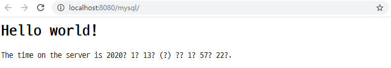

### 1.3.4 pom.xml 추가 설정

- 각각의 Dependency 버전은 [Maven Repository](https://mvnrepository.com/)에서 확인

- Spring-test, Spring-JDBC, Spring-tx 

  ```xml
  ...
  <!-- Spring Test -->
  <!-- https://mvnrepository.com/artifact/org.springframework/spring-test -->
  <dependency>
  	<groupId>org.springframework</groupId>
  	<artifactId>spring-test</artifactId>
  	<version>${org.springframework-version}</version>
  	<scope>test</scope>
  </dependency>
  <!-- Spring JDBC -->
  <!-- https://mvnrepository.com/artifact/org.springframework/spring-jdbc -->
  <dependency>
  	<groupId>org.springframework</groupId>
  	<artifactId>spring-jdbc</artifactId>
  	<version>${org.springframework-version}</version>
  </dependency>
  <!-- Spring Transaction -->
  <!-- https://mvnrepository.com/artifact/org.springframework/spring-tx -->
  <dependency>
  	<groupId>org.springframework</groupId>
  	<artifactId>spring-tx</artifactId>
  	<version>${org.springframework-version}</version>
  </dependency>
  ...
  ```

- MyBatis, MyBatis-Spring, HikariCP, log4jdbc

  - HikariCP : 미리 커넥션 객체를 생성하고 해당 케넥션 객체를 관리해준다.

  ```xml
  ...
  <!-- MyBatis -->
  <!-- https://mvnrepository.com/artifact/org.mybatis/mybatis -->
  <dependency>
  	<groupId>org.mybatis</groupId>
  	<artifactId>mybatis</artifactId>
  	<version>3.5.3</version>
  </dependency>
  <!-- MyBatis-Spring -->
  <!-- https://mvnrepository.com/artifact/org.mybatis/mybatis-spring -->
  <dependency>
  	<groupId>org.mybatis</groupId>
  	<artifactId>mybatis-spring</artifactId>
  	<version>2.0.3</version>
  </dependency>
  <!-- HikariCP -->
  <!-- https://mvnrepository.com/artifact/com.zaxxer/HikariCP -->
  <dependency>
  	<groupId>com.zaxxer</groupId>
  	<artifactId>HikariCP</artifactId>
  	<version>3.4.1</version>
  </dependency>
  <!-- log4jdbc -->
  <!-- https://mvnrepository.com/artifact/org.bgee.log4jdbc-log4j2/log4jdbc-log4j2-jdbc4 -->
  <dependency>
  	<groupId>org.bgee.log4jdbc-log4j2</groupId>
  	<artifactId>log4jdbc-log4j2-jdbc4</artifactId>
  	<version>1.16</version>
  </dependency>
  ...
  ```

## 2. Lombok

- Java 개발 시 자주 사용하는 **getter/setter, toString(), 생성자 등을 자동으로 생성**해주므로 유용하다.

### 2.1 다운로드

- [다운로드](https://projectlombok.org/download)

  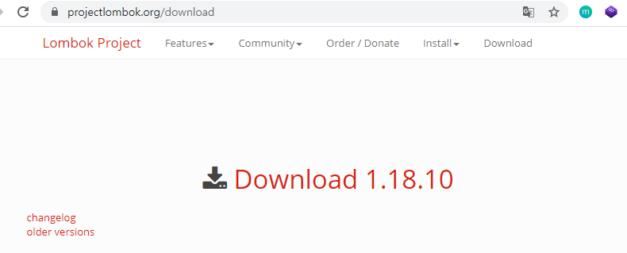

### 2.2 설치

- 해당 파일을 다운로드 받은 경로에서 **CMD**를 열고

  ```bash
  $ java -jar lombok.jar
  ```

- **이클립스 경로를 찾아서 설치 진행**

  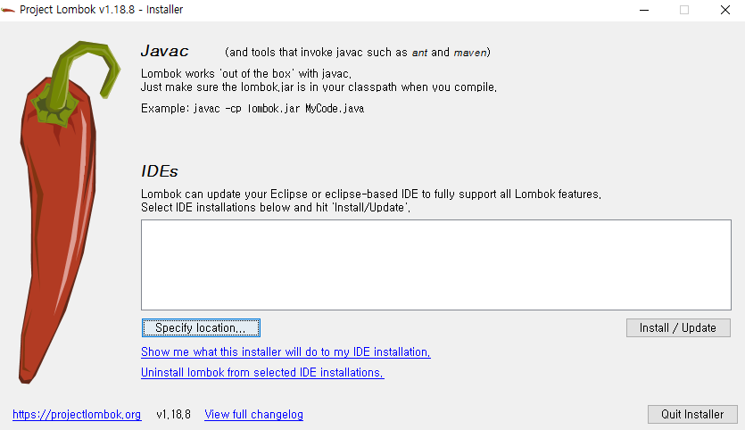

- 설치가 완료되면 **바탕화면의 바로가기는 삭제**하고 새로 만들어준다.

### 2.3 pom.xml설정

- 테스트와 lombok 사용을 위한dependency 추가

  ```xml
  ...
  <!-- lombok -->
  <!-- https://mvnrepository.com/artifact/org.projectlombok/lombok -->
  <dependency>
  	<groupId>org.projectlombok</groupId>
  	<artifactId>lombok</artifactId>
  	<version>1.18.0</version>
  	<scope>provided</scope>
  </dependency>
  ...
  ```

### 2.4 추가 설정

- Web 페이지가 실행될 때 **'/' 경로에서 프로젝트가 실행되**도록 해보자.

  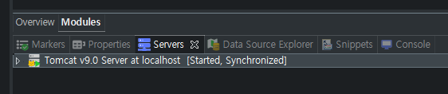

- **Servers - Tomcat v9.0 더블클릭**

  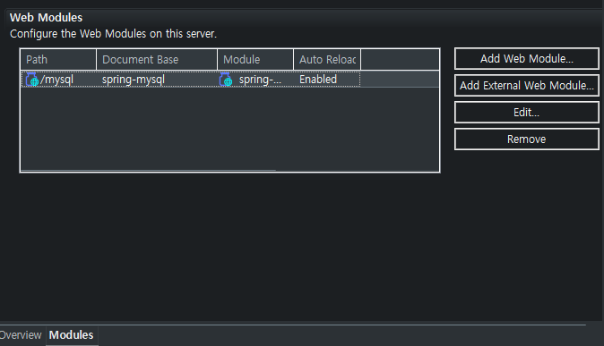

- **Modules - Edit - path**를 /로 교체

  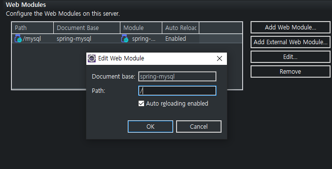

- 확인

  


## 3. MySQL 연동

### 3.1 Java Connector

- [MySQL Connector 다운로드](https://dev.mysql.com/downloads/connector/j/)
  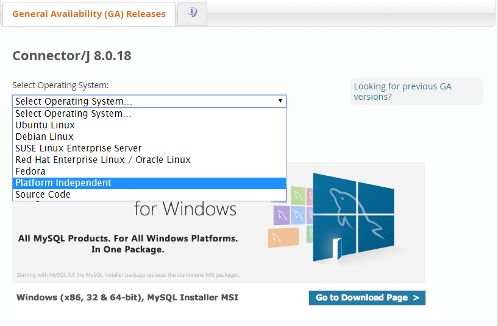

- **Platform Independent - ZIP Archive 다운로드 후 압축 해제**

  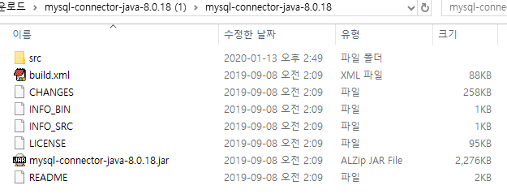

- **프로젝트 우클릭 - Build Path - Configure Build Path...**

  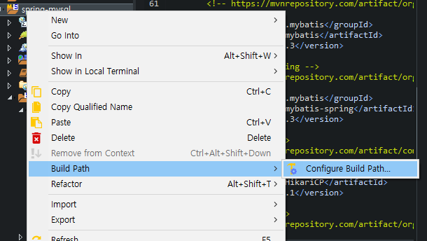

- **Libraries - Add External JARs..**

  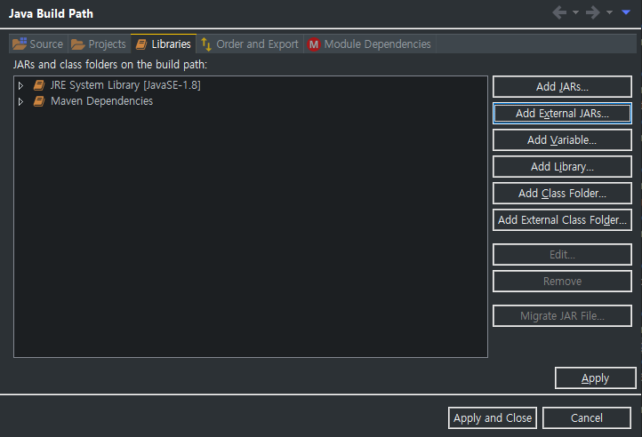

- 압축 해제된 폴더의 jar 파일을 적용해준다.

- [오류 해결 방법](https://m.blog.naver.com/PostView.nhn?blogId=svljwnv&logNo=60182079854&proxyReferer=https%3A%2F%2Fwww.google.com%2F)

### 3.2 root-context.xml

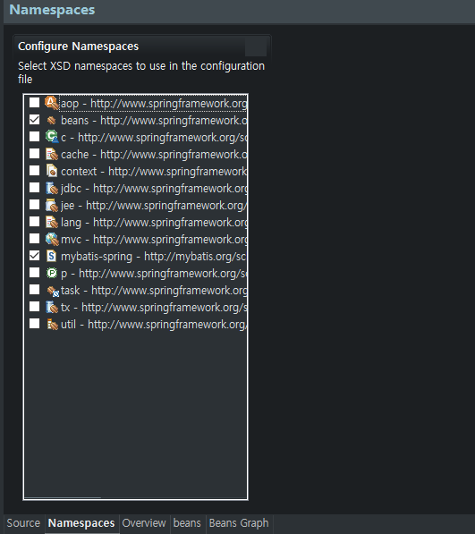

- **root-context - Namespaces - mybatis-spring 체크**

- HikariCP + log4j

  ```xml
  <!-- Root Context: defines shared resources visible to all other web components --><bean id="hikariConfig" class="com.zaxxer.hikari.HikariConfig">
  
  	<!-- <property name="driverClassName" value="com.mysql.cj.jdbc.Driver"></property> -->
  	<property name="driverClassName" value="net.sf.log4jdbc.sql.jdbcapi.DriverSpy"></property>
  	<!-- xml은 &을 인식하지 못하므로 &amp;로 수정 -->
  	<!-- <property name="jdbcUrl" value="jdbc:mysql://localhost:3306/test?characterEncoding=UTF-8&amp;serverTimezone=UTC"></property> -->
  	<property name="jdbcUrl"
  			value="jdbc:log4jdbc:mysql://localhost:3306/test?characterEncoding=UTF-8&amp;serverTimezone=Asia/Seoul"></property>
  
  	<property name="username" value="book_ex"></property>
  	<property name="password" value="book_ex"></property>
  </bean>
  
  <!-- HikariCP configuration -->
  <bean id="dataSource" class="com.zaxxer.hikari.HikariDataSource" destroy-method="close">
  	<constructor-arg ref="hikariConfig" />
  </bean>
  
  <!-- SQLSessionFactory -->
  <bean id="sqlSessionFactory" class="org.mybatis.spring.SqlSessionFactoryBean">
  	<property name="dataSource" ref="dataSource"></property>
  </bean>
  
  <mybatis-spring:scan base-package="com.test.mapper" />
  ```

- src/main/resources에 log4jdbc.log4j2.properties

  ```
  log4jdbc.spylogdelegator.name=net.sf.log4jdbc.log.slf4j.Slf4jSpyLogDelegator
  ```

- 폴더 구조

  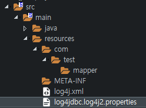

- JDBCTests 클래스 생성

  - src/test/persistence에 생성

  ```java
  @Log4j
  public class JDBCTests {
  	static {
  		try {
  			// 8버전 이후부터 com.mysql.cj.jdbc.Driver
  			Class.forName("com.mysql.cj.jdbc.Driver");
  		} catch (Exception e) {
  			e.printStackTrace();
  		}
  	}
                           
  	@Test
  	public void testConnection() {
  		try(Connection con = DriverManager.getConnection(
  				// 5.1.X 이후 버전부터 KST 타임존을 인식하지 못함
  				"jdbc:mysql://localhost:3306/test?characterEncoding=UTF-8&serverTimezone=UTC",
  				"book_ex",
  				"book_ex")){
  			
  			log.info(con);
  		} catch (Exception e) {
  			fail(e.getMessage());
  		}
  	}
  }
  ```

- JUnit을 통한 DB연결 확인

  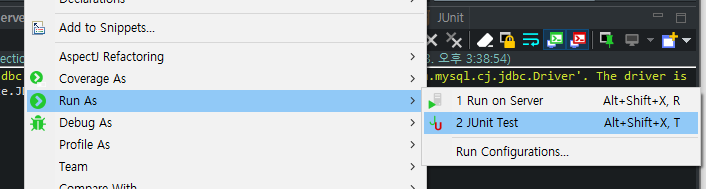

- 성공시

  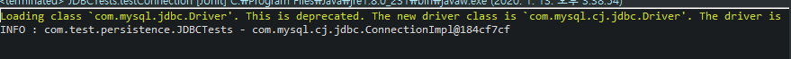