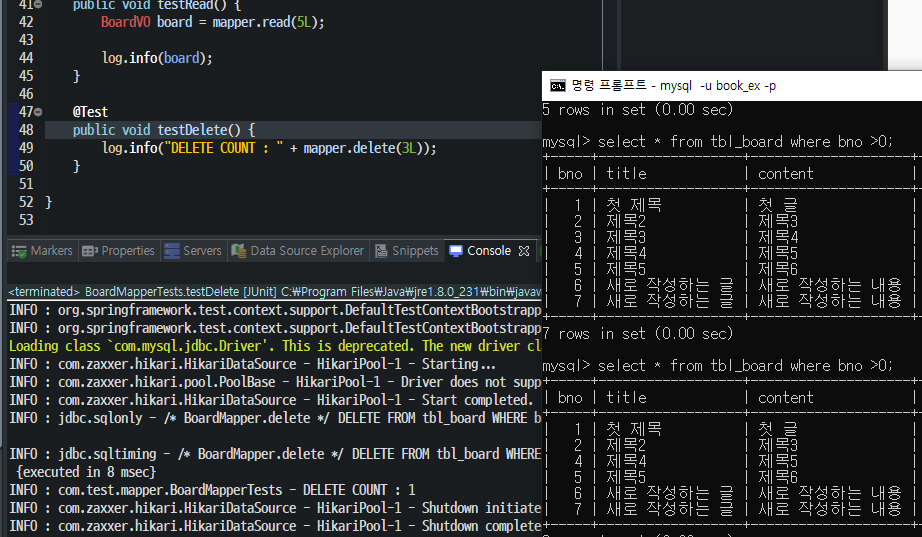

# Spring CRUD 구현


- **프레젠테이션 계층** (Presentation layer) - **UI 계층** (UI layer) 이라고도 함
- **애플리케이션 계층** (Application layer) - **서비스 계층** (Service layer) 이라고도 함
- **비즈니스 논리 계층** (Business logic layer) - **도메인 계층** (Domain layer) 이라고도 함
- **데이터 접근 계층** (Data access layer) - **영속 계층** (Persistence layer) 이라고도 함
- _각 계층은 **다음 상위 계층에 서비스를 제공** 한다._

## 1. 영속 계층 구현


- **데이터 처리를 담당**하는 계층
- 영속 계층의 작업은 항상 다음과 같은 순서로 진행
  - 테이블의 칼럼 구조를 반영하는 VO(Value Object) 클래스의 생성
  - MyBatis의 Mapper 인터페이스의 작성/XML 처리
  - 작성한 Mapper 인터페이스의 테스트

### 1.1 VO 클래스 작성

- 프로젝트에 **`com.test.domain`** 패키지를 생성하고, BoardVO 클래스를 정의

  

  ```java
  @Data	// getter/setter, toString()을 지원
  public class BoardVO {
  
  	private Long bno;
  	private String title;
  	private String content;
  	private String writer;
  	private Date regdate;
  	private Date updateDate;
  }
  ```

### 1.2 Mapper

#### 1.2.1 Mapper 인터페이스

- root-context.xml 추가

  ```xml
  <mybatis-spring:scan base-package="com.test.mapper"/>
  ```

- 프로젝트에 **`com.test.mapper`** 패키지를 생성하고, BoardMapper 인터페이스를 정의

  ```java
  public interface BoardMapper {
  	@Select("SELECT * FROM tbl_board WHERE bno > 0")
  	public List<BoardVO> getList();
  }
  ```

- **`src/test/java`** 에 **`com.test.mapper`** 패키지를 생성하고 BoardMapperTests 클래스를 추가

  ```java
  @RunWith(SpringJUnit4ClassRunner.class)
  @ContextConfiguration("file:src/main/webapp/WEB-INF/spring/root-context.xml")
  @Log4j
  public class BoardMapperTests {
  	
  	@Setter(onMethod_ = @Autowired)
  	private BoardMapper mapper;
  	
  	@Test
  	public void testGetList() {
  		mapper.getList().forEach(board -> log.info(board));
  	}
  }
  ```

- 테스트 결과

  

#### 1.2.2 Mapper XML

- **`src/main/resources`**에 패키지와 동일한 **`com/test/mapper`** 단계의 폴더를 생성하고 XML 파일을 작성

  

- BoardMapper.xml

  ```xml
  <?xml version="1.0" encoding="UTF-8"?>
  <!DOCTYPE mapper PUBLIC "-//mybatis.org//DTD Mapper 3.0//EN"
  	"http://mybatis.org/dtd/mybatis-3-mapper.dtd">
  <mapper namespace="com.test.mapper.BoardMapper">
  
  	<select id="getList" resultType="com.test.domain.BoardVO">
  		<!-- CDATA는 안에 들어가는 테스트가 파싱되지 않게 하는 기능 -->
  		/* BoardMapper.getList */
  		<![CDATA[
  			SELECT * FROM tbl_board WHERE bno >0
  		]]>
  	</select>
  </mapper>
  ```

- XML 파일에 SQL문이 처리되었으니 **BoardMapper 인터페이스에 SQL은 제거** 후 테스트 확인

  

### 1.3 CRUD 구현 및 테스트

#### 1.3.1 Create

- BoardMapper 인터페이스 

  ```java
  public void insert(BoardVO board);
  	
  public void insertSelectKey(BoardVO board);
  ```

- BoardMapper.xml

  ```xml
  <insert id="insert">
  	/* BoardMapper.insert */
  	INSERT INTO tbl_board (title, content, writer)
  	VALUES (#{title}, #{content}, #{writer})
  </insert>
  
  <insert id="insertSelectKey">
  	<selectKey keyProperty="bno" order="BEFORE" resultType="long">
  		SELECT IFNULL(MAX(bno), 0) + 1 FROM tbl_board
  	</selectKey>
  	/* BoardMapper.insertSelectKey */
  	INSERT INTO tbl_board (bno, title, content, writer)
  	VALUES (#{bno}, #{title}, #{content}, #{writer})
  </insert>
  ```

- BoardMapperTests.java

  ```java
  @Test
  public void testInsert() {
  		
  	BoardVO board = new BoardVO();
  	board.setTitle("새로 작성하는 글");
  	board.setContent("새로 작성하는 내용");
  	board.setWriter("newbie");
  	
  	mapper.insert(board);
  	log.info(board);
  		
  }
  ```

- insert 성공시

  

#### 1.3.2 Read

- BoardMapper 인터페이스

  ```java
  public BoardVO read(long bno);
  ```

- BoardMapper.xml

  ```xml
  <select id="read" resultType="com.test.domain.BoardVO">
  	SELECT * FROM tbl_board WHERE bno = #{bno}
  </select>
  ```

- BoardMapperTests 클래스

  ```java
  @Test
  public void testRead() {
      BoardVO board = mapper.read(5L);
      
      log.info(board);
  }
  ```

- Read 성공시

  

#### 1.3.3 Update

- BoardMapper 인터페이스

  ```java
  public int update(BoardVO board);
  ```

- BoardMapper.xml

  ```xml
  <update id="update">
  	/* BoardMapper.update */
  	UPDATE tbl_board
  	SET title=#{title}, content=#{content}, writer=#{writer}, updatedate=NOW()
  	WHERE bno=#{bno} 
  </update>
  ```

- BoardMapperTests 클래스

  ```java
  @Test
  public void testUpdate() {
  	BoardVO board = new BoardVO();
  	board.setBno(6L);
  	board.setTitle("수정된 제목");
  	board.setContent("수정된 내용");
  	board.setWriter("user00");
  
  	int count = mapper.update(board);
  	log.info("UPDATE COUNT: " + count);
  }
  ```

- update 성공 시

  

#### 1.3.4 Delete

- BoardMapper 인터페이스

  ```java
  public int delete(long bno);
  ```

- BoardMapper.xml

  ```xml
  <delete id="delete">
  	/* BoardMapper.delete */
  	DELETE FROM tbl_board WHERE bno = #{bno}
  </delete>
  ```

- BoardMapperTests 클래스

  ```java
  @Test
  public void testDelete() {
      log.info("DELETE COUNT : " + mapper.delete(3L));
  }
  ```

- delete 성공시

  

## 2. 비즈니스 계층 구현


- 고객의 요구사항을 반영하는 계층으로 프레젠테이션 계층과 영속 계층의 **중간 다리 역할**

### 2.1 설정

- **`src/main/java`에 `com.test.service` 패키지** 작성 후 BoardService 인터페이스와 BoardServiceImpl 클래스를 선언하자.

  

- BoardService 인터페이스

  ```java
  public interface BoardService {
  
  		public void register(BoardVO board);
  		
  		public BoardVO get(Long bno);
  		
  		public boolean modify(BoardVO board);
  		
  		public boolean remove(Long bno);
  		
  		public List<BoardVO> getList();
  		
  }
  ```

- BoardServiceImpl 클래스

  ```java
  @Service
  @AllArgsConstructor
  public class BoardServiceImpl implements BoardService{
  
  	private BoardMapper mapper;
  
      @Override
      ...
  }
  ```

#### 2.1.1 서비스 객체 설정(root-context.xml)

- 비즈니스 계층의 인터페이스와 구현 클래스가 작성되었다면, 이를 **스프링의 빈으로 인식**하기 위해서 **root-context.xml에 @Service 어노테이션이 있는 `com.test.service` 패키지를 스캔하도록 추가**해야한다.

  

- 태그 추가

  ```xml
  <context:component-scan base-package="com.test.service"></context:component-scan>
  ```

### 2.2 CRUD 구현 및 테스트

- **`src/test/java`** 에 **`com.test.service` 패키지**를 생성 후 BoardServiceTests 클래스 작성

  
  
- BoardServiceTests 클래스

  ```java
  @RunWith(SpringJUnit4ClassRunner.class)
  @ContextConfiguration("file:src/main/webapp/WEB-INF/spring/root-context.xml")
  @Log4j
  public class BoardServiceTests {
  	
  	@Setter(onMethod_ = {@Autowired})
  	private BoardService service;
  	
  	@Test
  	public void testExist() {
  		log.info(service);
  		assertNotNull(service);
  	}
  }
  ```

- 테스트 성공시

  

#### 2.2.1 Create 구현 및 테스트

- BoardServiceImpl

  ```java
  @Override
  public void register(BoardVO board) {
  	System.out.println("register......" + board);
  	mapper.insertSelectKey(board);
  }
  ```

- BoardServiceTests

  ```java
  @Test
  public void testRegister() {
  	BoardVO board = new BoardVO();
  	board.setTitle("새로 작성하는 글");
  	board.setContent("새로 작성하는 내용");;
  	board.setWriter("newbie");
  	
  	service.register(board);
  	log.info("생성된 게시물의 번호 : " + board.getBno());
  }
  ```

- 테스트 성공시

  

#### 2.2.2 Read

##### 2.2.2.1 목록 작업의 구현 및 테스트

- BoardServiceImple

  ```java
  @Override
  public List<BoardVO> getList() {
  	System.out.println("getList......");
  	return mapper.getList();
  }
  ```

- BoasrdServiceTests

  ```java
  @Test
  public void testGetList() {
  	service.getList().forEach(board -> log.info(board));
  }
  ```

- 테스트 성공시

  

##### 2.2.2.2 조회 작업의 구현 및 테스트

- BoardServiceImpl

  ```java
  @Override
  public BoardVO get(Long bno) {
  	System.out.println("get......" + bno);
  	return mapper.read(bno);
  }
  ```

- BoardServiceTests

  ```java
  @Test
  public void testGet() {
      log.info(service.get(1L));
  }
  ```

- 테스트 성공시

  

#### 2.2.3 Update & Delete

- BoardServiceImpl

  ```java
  @Override
  public boolean modify(BoardVO board) {
  	System.out.println("modify......" + board);
  	return mapper.update(board) == 1;
  }
  
  @Override
  public boolean remove(Long bno) {
      System.out.println("remove......" + bno);
      return mapper.delete(bno) == 1;
  }
  ```

  - 정상적으로 수정과 삭제가 이루어지면 1이라는 값이 반환되기 때문에 `==` 으로 true/false 처리

- BoardServiceTests

  ```java
  @Test
  public void testUpdate() {
  	BoardVO board = service.get(1L);
  	
  	if (board == null) {
  		return;
  	}
  	
  	board.setTitle("제목 수정합니다.");
  	log.info("MODIFY RESULT : " + service.modify(board));
  }
  	
  @Test
  public void testDelete() {
  	log.info("REMOVE RESULT : " + service.remove(2L));
  }
  ```

- 테스트 성공시

  

## 3. 프레젠테이션 계층 구현


- 프레젠테이션 계층은 말 그대로 사용자 인터페이스이다.

### 3.1 Controller 작성

- **`src/main/java`**에 **`com.test.controller` 패키지** 생성 후 BoardController 클래스 작성

  ```java
  @Controller
  @RequestMapping("/board/*")
  public class BoardController {
  	
  }
  ```

  - **@Controller** : 컨트롤러로서 스프링의 빈으로 인식하게 한다.
  - **@RequestMapping**을 통해서 `'/board'`로 시작하는 모든 처리를 BoardController가 하도록 지정

-  **`webapp/WEB-INF/spring/sppServlet/`**에서 **servlet-context.xml** 확인

  

- `<context:component-scan ...`패키지를 확인 잘못 되었다면 컨트롤러가 있는 패키지로 변경

  ```xml
  <context:component-scan base-package="com.test.controller" />
  ```

### 3.2 CRUD구현 및 테스트

- 먼저 **전체 목록**을 가져오는 처리를 먼저 작성

- BoardController

  ```java
  @Controller
  @RequestMapping("/board/*")
  @AllArgsConstructor
  public class BoardController {
  	
  	private BoardService service;
  	
  	@GetMapping("/list")
  	public void list(Model model) {
  		model.addAttribute("list", service.getList());
  	}
  }
  ```

  - list()는 게시물의 목록을 전달해야 하므로 Model을 파라미터로 지정
  - 이를 통해서 BoardServiceImpl 객체의 getList() 결과를 담아 전달(addAttribute)

- **`src/test/java`**에 **`com.test.controller` 패키지**에 BoardControllerTests 클래스 선언

  ```java
  // BoardControllerTests
  
  @RunWith(SpringJUnit4ClassRunner.class)
  @WebAppConfiguration
  @ContextConfiguration({ "file:src/main/webapp/WEB-INF/spring/root-context.xml",
  		"file:src/main/webapp/WEB-INF/spring/appServlet/servlet-context.xml" })
  @Log4j
  public class BoardControllerTests {
  
  	@Setter(onMethod_ = { @Autowired })
  	private WebApplicationContext ctx;
  
  	private MockMvc mockMvc;
  
  	@Before
  	public void setup() {
  		this.mockMvc = MockMvcBuilders.webAppContextSetup(ctx).build();
  	}
  
  	@Test
  	public void testList() throws Exception {
  		log.info(
  				mockMvc.perform(MockMvcRequestBuilders.get("/board/list"))
  					   .andReturn()
  					   .getModelAndView()
  					   .getModelMap()
  				);
  	}
  }
  ```

  - **@Before**가 적용된 메서드는 모든 테스트 전에 매번 실행되는 매서드가 된다.
  - **MockMvc**는 가짜로 URL과 파라미터 등을 브라우저에서 사용하는 것처럼 만들어서 테스트 가능하다.
  - MockMvcRequestsBuilders라는 존재를 이용해서 GET 방식의 호출을 한다.

- JUnit 세션 테스트시 ` java.lang.NoClassDefFoundError: javax/servlet/SessionCookieConfig`오류 발생 시

  - pom.xml 추가 사항

    ```xml
    <!-- https://mvnrepository.com/artifact/javax.servlet/javax.servlet-api -->
    <dependency>
    	<groupId>javax.servlet</groupId>
        <artifactId>javax.servlet-api</artifactId>
        <version>3.1.0</version>
        <scope>provided</scope>
    </dependency>
    ```

- 테스트 성공시

  

#### 3.2.1 Create 등록 처리 및 테스트

- BoardController

  ```java
  @PostMapping("/register")
  public String register(BoardVO board, RedirectAttributes rttr) {
  	service.register(board);
  	rttr.addFlashAttribute("result", board.getBno());
  	
  	return "redirect:/board/list";
  }
  ```

- BoardControllerTests

  ```java
  @Test
  public void testRegister() throws Exception {
  	String resultPage = mockMvc
  				.perform(MockMvcRequestBuilders.post("/board/register")
                  .param("title", "테스트 새글 제목")
  				.param("content", "테스트 새글 내용").param("writer", "user00"))
  				.andReturn().getModelAndView().getViewName();
  
  	log.info(resultPage);
  }
  ```

- 테스트 성공시

  

#### 3.2.2 Read

- BoardController

  ```java
  @GetMapping("/get")
  public void get(@RequestParam("bno") Long bno, Model model) {
  	model.addAttribute("board", service.get(bno));
  }
  ```

- BoardControllerTests

  ```java
  @Test
  public void testGet() throws Exception {
  		log.info(mockMvc.perform(MockMvcRequestBuilders.get("/board/get")
                                 	.param("bno", "2")).andReturn()
  								.getModelAndView().getModelMap());
  }
  ```

- 테스트 성공시

  

#### 3.2.3 Update

- BoardController

  ```java
  @PostMapping("/modify")
  public String modify(BoardVO board, RedirectAttributes rttr) {
  	if (service.modify(board)) {
  		rttr.addFlashAttribute("result", "success");
  	}
  	
  	return "redirect:/board/list";
  }
  ```

- BoardControllerTests

  ```java
  @Test
  public void testModify() throws Exception {
  	String resultPage = mockMvc.perform(MockMvcRequestBuilders
                     			            .post("/board/modify").param("bno", "1")
                                          .param("title", "수정된 테스트 새글 제목")
  										.param("content", "수정된 테스트 새글 내용")
                                          .param("writer", "user00"))
  										.andReturn().getModelAndView().getViewName();
  	log.info(resultPage);
  }
  ```

- 테스트 성공시

  

#### 3.2.4Delete

- BoardController

  ```java
  @PostMapping("/remove")
  	public String remove(@RequestParam("bno") Long bno, RedirectAttributes rttr) {
  		if (service.remove(bno)) {
  			rttr.addFlashAttribute("result", "success");
  		}
  
  		return "redirect:/board/list";
  	}
  ```

- BoardControllerTests

  ```java
  @Test
  public void testRemove() throws Exception {
  	String resultPage = mockMvc.perform(MockMvcRequestBuilders.post("/board/remove")
                                          .param("bno", "25"))
          						.andReturn().getModelAndView().getViewName();
  
  	log.info(resultPage);
  }
  ```

- 테스트 성공시

  

