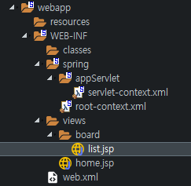
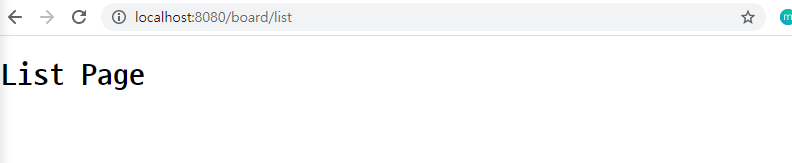
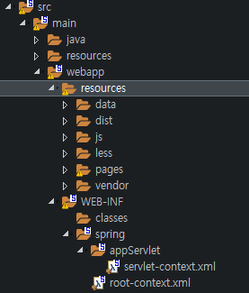
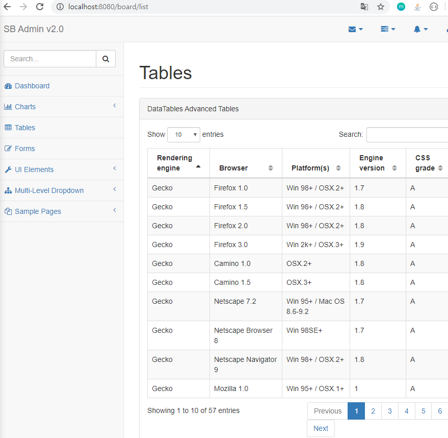
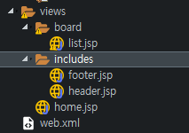
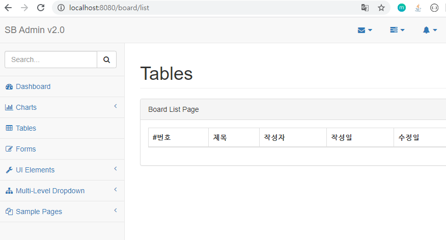
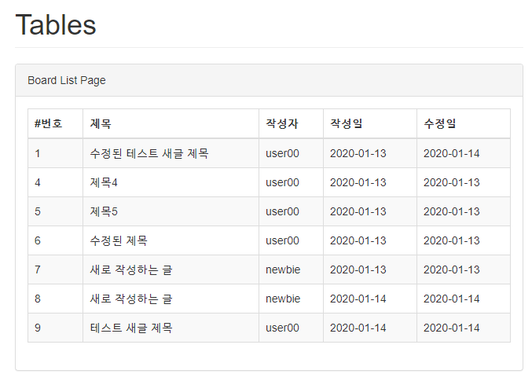
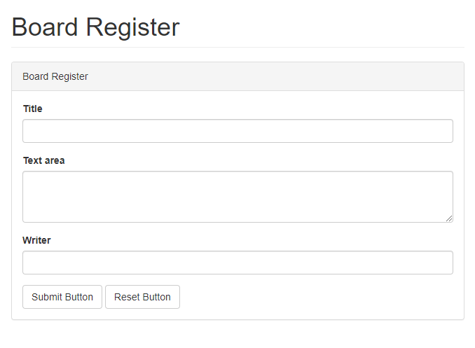
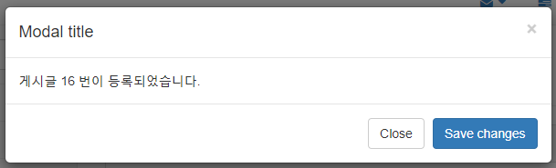
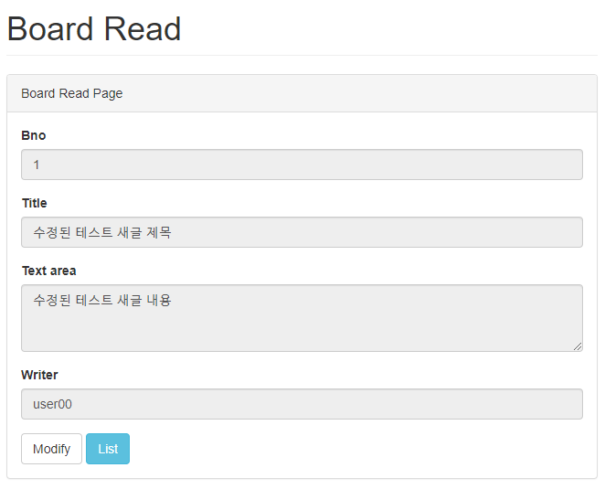

# 화면 처리

- 이전 CRUD 구현에 이어서 작업

## 1. 목록 페이지 작업과 includes

- servlet-context.xml 확인

  ```xml
  <context:component-scan base-package="com.test.controller" />
  ```

  - 컨트롤러가 존재하는 **패키지인지 확인**하자. 대소문자 또한 구분한다.

- `src/main/webapp/WEB-INF/views/board` 에 list.jsp 생성

  

- list.jsp

  ```html
  <%@ page language="java" contentType="text/html; charset=UTF-8"
  	pageEncoding="UTF-8"%>
  <!DOCTYPE html PUBLIC "-//W3C//DTD HTML 4.01 Transitional//EN" "http://www.w3.org/TR/html4/loose.dtd">
  <html>
  <head>
  <meta http-equiv="Content-Type" content="text/html; charset=UTF-8">
  <title>Board</title>
  </head>
  <body>
  	<h1>List Page</h1>
  </body>
  </html>
  ```

- 서버 확인

  

### 1.1 SB Admin2 페이지 적용

- SB Admin2의 pages 폴더에 있는 tables.html 내용을 list.jsp에 복사
  - list.jsp 상단의 JSP의 Page 지시자는 제외하고 삭제

- `webapp/resources`에 SB Admin2의 모든 폴더를 복사

  

- list.jsp 파일에서 모든 경로를 `/resources/`로 교체하면 다음과 같은 화면이 나온다.

  

### 1.2 includes 적용

- JSP를 작성할 때마다 많은 양의 HTML 코드를 이용하는 것을 지양해야한다.

  - `/views` 폴더에 includes 폴더를 생성하고, header.jsp와 footer.jsp를 선언

    

- header.jsp

  ```html
  <!DOCTYPE html>
  ...
  <div id="page-wrapper">
  ```

- list.jsp

  ```html
  <%@ page language="java" contentType="text/html; charset=UTF-8"
  	pageEncoding="UTF-8"%>
  
  <%@ include file="../includes/header.jsp" %>
  
  <div class="row">
      
  ...
      
  </div>
  <!-- /.row -->
      
  <%@ include file="../includes/footer.jsp" %>
  ```

- footer.jsp

  ```html
  </div>
  <!-- /#page-wrapper -->
  ...
  ```

  - footer의 JQuery script 태그를 제거하고 header의 마지막 부분에 다음 코드 추가

    ```html
    <script src="https://ajax.googleapis.com/ajax/libs/jquery/3.4.1/jquery.min.js"></script>
    ```

- 추가 해결 사항

  - JQuery 교체 후 모바일 크기에서 새로 고침 시에 메뉴가 펼쳐지는 문제 해결

    ```html
    <script>
    	$(document).ready(
    			function() {
    				$('#dataTables-example').DataTable({
    					responsive : true
    				});
    
    				$(".sidebar-nav").attr("class",
    						"sidebar-nav navbar-collapse collapse").attr(
    						"aria-expanded", 'false').attr("style", "height:1px");
    			});
    </script>
    ```

### 1.3 목록 화면 처리

- list.jsp 수정

  ```html
  <%@ page language="java" contentType="text/html; charset=UTF-8"
  	pageEncoding="UTF-8"%>
  
  <%@ include file="../includes/header.jsp"%>
  
  <div class="row">
  	<div class="col-lg-12">
  		<h1 class="page-header">Tables</h1>
  	</div>
  	<!-- /.col-lg-12 -->
  </div>
  <!-- /.row -->
  <div class="row">
  	<div class="col-lg-12">
  		<div class="panel panel-default">
  			<div class="panel-heading">Board List Page</div>
  			<!-- /.panel-heading -->
  			<div class="panel-body">
  				<table class="table table-striped table-bordered table-hover">
  					<thead>
  						<tr>
  							<th>#번호</th>
  							<th>제목</th>
  							<th>작성자</th>
  							<th>작성일</th>
  							<th>수정일</th>
  						</tr>
  					</thead>
  
  				</table>
  			</div>
  			<!-- end panel-body -->
  		</div>
  		<!-- end panel -->
  	</div>
  </div>
  <!-- /.row -->
  
  <%@ include file="../includes/footer.jsp"%>
  ```

- 실행시 화면

  

### 1.4 데이터 출력

- BoardController에서 'list'라는 이름으로 담아서 전달했으므로 list.jsp에서는 이를 출력한다.

  - BoardController 일부

    ```java
    @GetMapping("/list")
    public void list(Model model) {
    	model.addAttribute("list", service.getList());
    }
    ```

  - list.jsp

    ```html
    <%@ page language="java" contentType="text/html; charset=UTF-8"
    	pageEncoding="UTF-8"%>
    
    <%@ taglib uri="http://java.sun.com/jsp/jstl/core" prefix="c"%>
    <%@ taglib uri="http://java.sun.com/jsp/jstl/fmt" prefix="fmt"%>
    
    <%@ include file="../includes/header.jsp"%>
    
    <div class="row">
    	<div class="col-lg-12">
    		<h1 class="page-header">Tables</h1>
    	</div>
    	<!-- /.col-lg-12 -->
    </div>
    <!-- /.row -->
    <div class="row">
    	<div class="col-lg-12">
    		<div class="panel panel-default">
    			<div class="panel-heading">Board List Page</div>
    			<!-- /.panel-heading -->
    			<div class="panel-body">
    				<table class="table table-striped table-bordered table-hover">
    					<thead>
    						<tr>
    							<th>#번호</th>
    							<th>제목</th>
    							<th>작성자</th>
    							<th>작성일</th>
    							<th>수정일</th>
    						</tr>
    					</thead>
    
    					<c:forEach items="${list}" var="board">
    						<tr>
    							<td><c:out value="${board.bno}" /></td>
    							<td><c:out value="${board.title}" /></td>
    							<td><c:out value="${board.writer}" /></td>
    							<td><fmt:formatDate pattern="yyyy-MM-dd"
    									value="${board.regdate}" /></td>
    							<td><fmt:formatDate pattern="yyyy-MM-dd"
    									value="${board.updateDate}" /></td>
    						</tr>
    					</c:forEach>
    				</table>
    			</div>
    			<!-- end panel-body -->
    		</div>
    		<!-- end panel -->
    	</div>
    </div>
    <!-- /.row -->
    
    <%@ include file="../includes/footer.jsp"%>
    ```

  - 데이터 출력 화면

    

## 2. 등록 입력 페이지와 등록 처리

### 2.1 등록 입력 페이지

- BoardController

  ```java
  @GetMapping("/register")
  public void register() {
      
  }
  ```

- `views/board` 에 register.jsp 생성

  ```html
  <%@ page language="java" contentType="text/html; charset=UTF-8"
  	pageEncoding="UTF-8"%>
  
  <%@ taglib uri="http://java.sun.com/jsp/jstl/core" prefix="c"%>
  <%@ taglib uri="http://java.sun.com/jsp/jstl/fmt" prefix="fmt"%>
  <%@ include file="../includes/header.jsp" %>
  <div class="row">
  	<div class="col-lg-12">
  		<h1 class="page-header">Board Register</h1>
  	</div>
  	<!-- /.col-lg-12 -->
  </div>
  <!-- /.row -->
  
  <div class="row">
  	<div class="col-lg-12">
  		<div class="panel panel-default">
  			
  			<div class="panel-heading">Board Register</div>
  			<!-- /.panel-heading -->
  			<div class="panel-body">
  				<form role="form" action="/board/register" method="POST">
  					
  					<div class="form-group">
  						<label>Title</label> <input class="form-control" name='title'>
  					</div>
  					
  					<div class="form-group">
  						<label>Text area</label>
  						<textarea rows="3" class="form-control" name='content'></textarea>
  					</div>
  					
  					<div class="form-group">
  						<label>Writer</label> <input class="form-control" name='writer'>
  					</div>
  					
  					<button type="submit" class="btn btn-default">Submit Button</button>
  					<button type="reset" class="btn btn-default">Reset Button</button>
  				</form>
  			</div> 
  		</div>
  	</div>
  </div>
  
  <%@ include file="../includes/footer.jsp" %>
  ```

- 페이지 화면

  

### 2.2 등록 처리

#### 2.2.1 한글 문제 해결

- web.xml 에 아래 코드 추가

  ```xml
  <!-- 한글 Encoding -->
  <filter>
  	<filter-name>encoding</filter-name>
  	<filter-class>
          org.springframework.web.filter.CharacterEncodingFilter
      </filter-class>
  	<init-param>
  		<param-name>encoding</param-name>
  		<param-value>UTF-8</param-value>
  	</init-param>
  </filter>
  	
  <filter-mapping>
  	<filter-name>encoding</filter-name>
  	<servlet-name>appServlet</servlet-name>
  </filter-mapping>
  ```

#### 2.2.2 모달 창 띄우기

- list.jsp

  ```html
  ...
  </table>
  
  <!--  Modal 추가 -->
  <div class="modal fade" id="myModal" tabindex="-1" role="dialog"
  		aria-labelledby="myModalLabel" aria-hidden="true">
  	<div class="modal-dialog">
  		<div class="modal-content">
  			<div class="modal-header">
  				<button type="button" class="close" 
                          data-dismiss="modal" aria-hidden="true">&times;</button>
  				<h4 class="modal-title" id="myModalLabel">Modal title</h4>
  			</div>
  			<div class="modal-body">처리가 완료되었습니다.</div>
  			<div class="modal-footer">
  				<button type="button" class="btn btn-default" 
                          data-dismiss="modal">Close</button>
  				<button type="button" class="btn btn-primary">
                      Save changes</button>
  			</div>
  		</div>
  		<!-- /.modal-content -->
  	</div>		
  	<!-- /.modal-dialog -->
  </div>
  <!-- /.modal -->
  
  ...
  
  <script type="text/javascript">
  	$(document).ready(function() {
  		
  		var result = '<c:out value="${result}"/>';
  		
  		checkModal(result);
  		
  		function checkModal(result) {
  			if (result === '') {
  				return;
  			}
  			if (parseInt(result) > 0) {
  				$(".modal-body").html("게시글 " + parseInt(result) + " 번이 등록되었습니다.");
  			}
  			
  			$("#myModal").modal("show");
  		}
  	});
  </script>
  ```

- 등록시 모달창

  

#### 2.2.3 리스트 페이지에서 등록 페이지로 가는 버튼 만들기

- list.jsp

  ```html
  <div class="panel-heading">Board List Page
  	<button id='regBtn' type="button" 
              class="btn btn-xs pull-right">Register New Board</button>
  </div>
  
  ...
  
  <!-- 스크립트 내 JQuery 추가 -->
  $("#regBtn").on("click", function() {
  	self.location = "/board/register";
  });
  ```

## 3. 조회

### 3.1 조회 페이지

- register.jsp를 복사해서 get.jsp로 작성하자.

  ```html
  <%@ page language="java" contentType="text/html; charset=UTF-8"
  	pageEncoding="UTF-8"%>
  
  <%@ taglib uri="http://java.sun.com/jsp/jstl/core" prefix="c"%>
  <%@ taglib uri="http://java.sun.com/jsp/jstl/fmt" prefix="fmt"%>
  <%@ include file="../includes/header.jsp"%>
  <div class="row">
  	<div class="col-lg-12">
  		<h1 class="page-header">Board Read</h1>
  	</div>
  	<!-- /.col-lg-12 -->
  </div>
  <!-- /.row -->
  
  <div class="row">
  	<div class="col-lg-12">
  		<div class="panel panel-default">
  
  			<div class="panel-heading">Board Read Page</div>
  			<!-- /.panel-heading -->
  			<div class="panel-body">
  
  				<div class="form-group">
  					<label>Bno</label> <input class="form-control" name='bno'
  						value='<c:out value="${board.bno}" />' readonly="readonly">
  				</div>
  
  				<div class="form-group">
  					<label>Title</label> <input class="form-control" name='title'
  						value='<c:out value="${board.title}" />' readonly="readonly">
  				</div>
  
  				<div class="form-group">
  					<label>Text area</label>
  					<textarea rows="3" class="form-control" name='content'
  						readonly="readonly"><c:out value="${board.content}" /></textarea>
  				</div>
  
  				<div class="form-group">
  					<label>Writer</label> <input class="form-control" name='writer'
  						value='<c:out value="${board.writer}" />' readonly="readonly">
  				</div>
  				
  				<button data-oper='modify' class="btn btn-default" onclick="location.href='/board/modify?bno=<c:out value="${board.bno}"/>'">Modify</button>
  				<button data-oper='list' class="btn btn-info" onclick="location.href='/board/list'">List</button>
  				
  			</div>
  		</div>
  	</div>
  </div>
  
  <%@ include file="../includes/footer.jsp" %>
  ```

- 조회 페이지

  

### 3.2 추가 사항

### 3.2.1 목록에서 조회 페이지로의 이동

- 제목 td 수정

  ```html
  <td><a href='/board/get?bno=<c:out value="${board.bno}"/>'><c:out value="${board.title}" /></a></td>
  ```

  